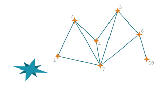
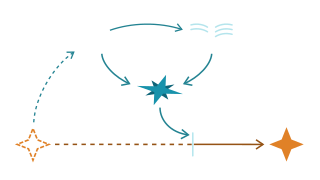

<section class="afs-section afs-section--intro" id="what">
  

    <h2>One shared record</h2>
    
Everything cited, versioned, and open to challenge.

  

  

    <article class="afs-feature-card">
      

        
      

      <a class="afs-card-title" href="best-practices/01-match-method-to-task/">Practices →</a>
      
Numbered, versioned practices, each with reasons, examples, and sources.

    </article>
    <article class="afs-feature-card">
      

        
      

      <a class="afs-card-title" href="library/">Library →</a>
      
The evidence base behind every citation, annotated and kept current.

    </article>
    <article class="afs-feature-card">
      

        
      

      <a class="afs-card-title" href="about/governance/">Challenge →</a>
      
Disagree with a practice? Challenges are formal, public, and logged.

    </article>
  

</section>

<section class="afs-section afs-section--involved" id="involved">
  

    <h2>Get involved</h2>
  

  

    <article class="afs-involved-card">
      <a class="afs-card-title" href="about/events/">Monthly meeting →</a>
      
An open monthly call for researchers, providers, and administrators.

    </article>
    <article class="afs-involved-card">
      <a class="afs-card-title" href="https://github.com/slolab/aiforscience.eu/discussions" target="_blank" rel="noopener noreferrer">Discussion →</a>
      
Questions, debate, and proposals, in the open. Start a thread or challenge a practice at any time.

    </article>
  

  
Also: <a href="https://github.com/slolab/aiforscience.eu/issues/new/choose">propose or challenge a practice</a> · <a href="about/contribute/">submit a document</a>.

</section>

<!-- Timeline section disabled for now; re-enable by removing these comment markers.
<section class="afs-section afs-section--activity" id="activity">
  

    
Status

    <h2>Where the record stands</h2>
  

  

    

      

        <time datetime="2026-07">2026-07</time>
        

          <strong>Practices in drafting</strong>
          The first set of best practices is being written from task-force observation. Proposals are open.
        

      

      

        <time datetime="2026-07">2026-07</time>
        

          <strong>Site launched</strong>
          Structure, governance, and contribution routes are in place. First dated release follows with the first practices.
        

      

    

  

</section>
-->

